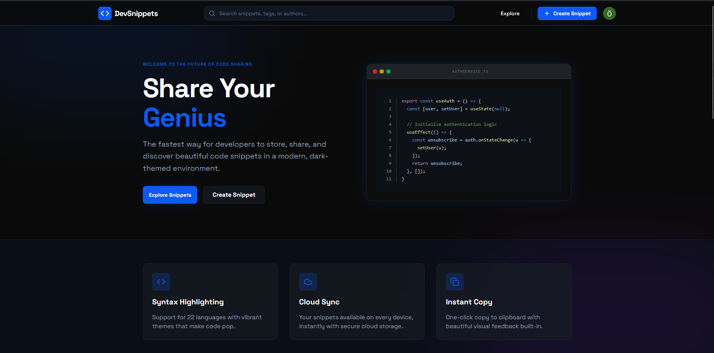
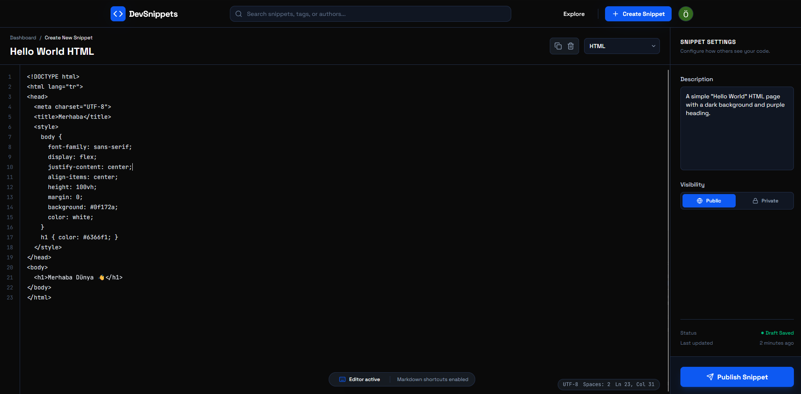
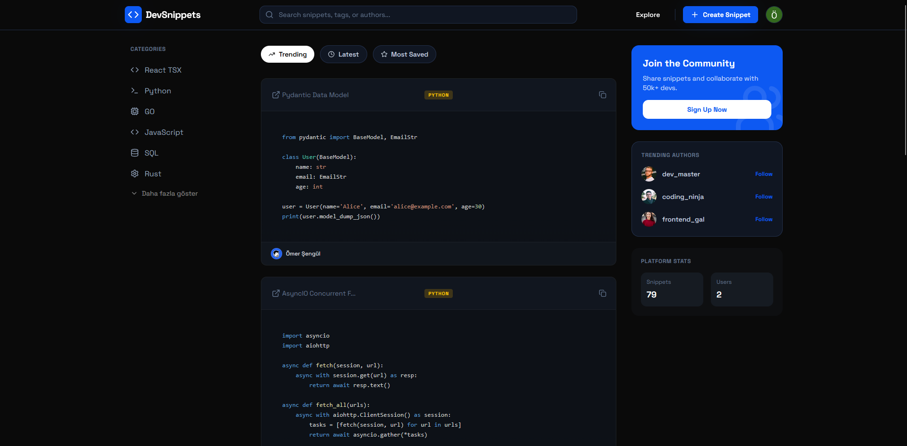
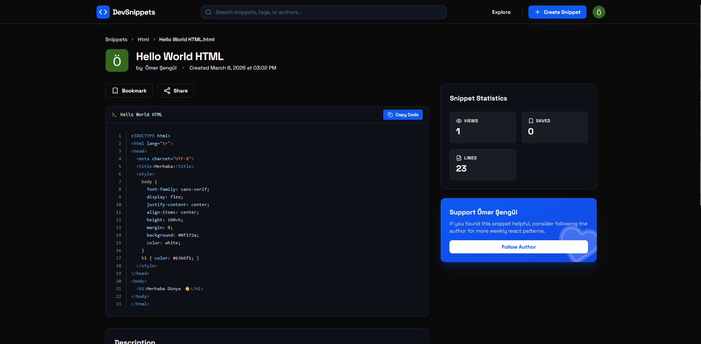
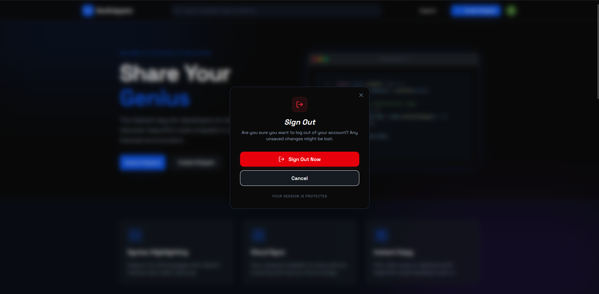

# 🧩 DevSnippets - Modern Code Sharing Hub
DevSnippets is a modern hub for developers to showcase their code genius. Securely store, share with beautiful themes, and discover community insights. Built for developers, by developers in a sleek, dark-themed environment.

🚀 **[View Live Demo](https://dev-snippets-eta.vercel.app/)**

---

## 📸 Screenshots

| | |
| :---: | :---: |
|  |  |
|  |  |
|  | |

---

## ✨ Features

- 🎨 **Syntax Highlighting:** Beautiful code rendering with React Syntax Highlighter & Prism.js, supporting 22+ languages.

- 🔐 **Secure Auth:** Sign in with OAuth to manage your personal snippet collection.

- 🌍 **Public & Private Snippets:** Control visibility — share with the community or keep it private.

- 🔍 **Explore & Discover:** Browse and filter community snippets by language, category, and more.

- 📋 **Instant Copy:** One-click copy to clipboard with smooth visual feedback via React Hot Toast.

- 📱 **Fully Responsive:** Flawless experience across all screen sizes.

- ⚡ **Fast & Modern:** Built on Next.js App Router with server components for optimal performance.

---

## 🛠️ Tech Stack

- **Frontend:** Next.js 15 (App Router), React, Tailwind CSS, Lucide React
- **Backend:** Next.js API Routes, Supabase (PostgreSQL)
- **Language:** TypeScript
- **Auth:** OAuth (via Supabase Auth)
- **Code Rendering:** React Syntax Highlighter, Prism.js
- **Notifications:** React Hot Toast
- **Deployment:** Vercel

---

## ⚙️ Installation

**1. Clone the repository:**
```bash
git clone https://github.com/omersengull/dev-snippets.git
```

**2. Install dependencies:**
```bash
bun install  # or npm install
```

**3. Set up environment variables:**

Create a `.env.local` file in the root directory:
```env
NEXT_PUBLIC_SUPABASE_URL=your_supabase_url
NEXT_PUBLIC_SUPABASE_ANON_KEY=your_supabase_anon_key
```

**4. Run the development server:**
```bash
bun dev
```

Open [http://localhost:3000](http://localhost:3000) in your browser.

---

## 📄 License

This project is licensed under the MIT License.
